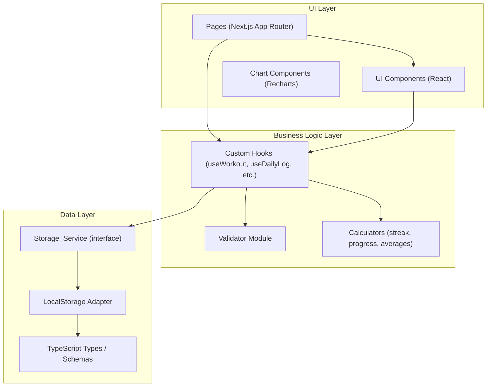

# Design Document — Fitness Tracker

## Overview

O Fitness Tracker é uma aplicação web responsiva (mobile-first) para controle de treino, evolução física e saúde. O usuário pode organizar seu plano semanal de exercícios, registrar a execução diária, acompanhar métricas (peso, hidratação, cardio) e visualizar sua evolução por meio de gráficos.

**Stack tecnológica:**
- **Framework:** Next.js 14 (App Router) com TypeScript
- **Estilização:** Tailwind CSS (dark mode por padrão)
- **Gráficos:** Recharts
- **Persistência inicial:** LocalStorage via `Storage_Service`
- **Testes:** Vitest + React Testing Library + fast-check (property-based testing)

**Princípios de design:**
- Separação estrita em camadas: dados → lógica de negócio → UI
- `Storage_Service` como única interface de acesso a dados, permitindo troca futura de backend (Firebase, PostgreSQL) sem alterar componentes de UI
- Validação centralizada em módulo `Validator` independente de framework
- Mobile-first com suporte a desktop via breakpoints Tailwind

---

## Architecture



**Fluxo de dados:**
1. Páginas montam componentes e invocam hooks customizados
2. Hooks coordenam validação, cálculos e persistência
3. `Storage_Service` serializa/desserializa JSON e acessa o LocalStorage
4. Nenhum componente de UI acessa o LocalStorage diretamente

**Estrutura de diretórios:**

```
src/
├── app/                        # Next.js App Router (páginas)
│   ├── page.tsx                # Dashboard
│   ├── workout/page.tsx        # Treino do Dia
│   ├── history/page.tsx        # Histórico
│   ├── plan/page.tsx           # Plano Semanal
│   └── goals/page.tsx          # Metas
├── components/                 # UI Components reutilizáveis
│   ├── cards/
│   ├── charts/
│   ├── forms/
│   └── navigation/
├── hooks/                      # Custom React Hooks
├── lib/
│   ├── storage/                # Storage_Service + adapters
│   ├── validators/             # Validator module
│   └── calculators/            # Funções puras de cálculo
└── types/                      # TypeScript types e interfaces
```

---

## Components and Interfaces

### Storage_Service Interface

```typescript
interface StorageService {
  // Plano Semanal
  getWeeklyPlan(): WeeklyPlan;
  saveWeeklyPlan(plan: WeeklyPlan): void;

  // Exercícios
  addExercise(dayOfWeek: DayOfWeek, exercise: Exercise): void;
  updateExercise(dayOfWeek: DayOfWeek, exercise: Exercise): void;
  removeExercise(dayOfWeek: DayOfWeek, exerciseId: string): void;
  reorderExercises(dayOfWeek: DayOfWeek, orderedIds: string[]): void;

  // Registro Diário
  getDailyLog(date: ISODateString): DailyLog | null;
  saveDailyLog(log: DailyLog): void;
  getDailyLogs(from: ISODateString, to: ISODateString): DailyLog[];

  // Execução de Exercício
  getExerciseExecutions(date: ISODateString): ExerciseExecution[];
  saveExerciseExecution(execution: ExerciseExecution): void;

  // Metas
  getGoals(): Goals | null;
  saveGoals(goals: Goals): void;
}
```

### Validator Module

```typescript
interface ValidationResult {
  valid: boolean;
  errors: Record<string, string>; // campo → mensagem de erro
}

interface Validator {
  validateExercise(data: Partial<Exercise>): ValidationResult;
  validateDailyLog(data: Partial<DailyLog>): ValidationResult;
  validateGoals(data: Partial<Goals>): ValidationResult;
  validateExerciseExecution(data: Partial<ExerciseExecution>): ValidationResult;
}
```

### Calculators

```typescript
// Funções puras — sem efeitos colaterais
function calculateStreak(logs: DailyLog[]): number;
function calculateWeeklyCompletionRate(logs: DailyLog[], plan: WeeklyPlan, weekStart: Date): number;
function calculateAverageWater(logs: DailyLog[], lastNDays: number): number;
function calculateWeightLost(initialWeight: number, currentWeight: number): number;
```

### Principais UI Components

| Componente | Responsabilidade |
|---|---|
| `MetricCard` | Exibe uma métrica com título, valor e unidade |
| `WeightChart` | Gráfico de linha — evolução do peso (últimos 30 registros) |
| `WorkoutFrequencyChart` | Gráfico de barras — frequência de treinos (últimos 30 dias) |
| `WaterChart` | Gráfico de barras — consumo de água (últimos 7 dias) |
| `ExerciseForm` | Formulário de cadastro/edição de exercício |
| `DailyLogForm` | Formulário de registro diário |
| `ExerciseExecutionCard` | Card de execução de exercício com campos editáveis |
| `GoalsForm` | Formulário de metas |
| `BottomNav` | Menu de navegação inferior (mobile) |
| `SideNav` | Menu de navegação lateral (desktop) |
| `Toast` | Notificação de confirmação/erro |
| `LoadingSpinner` | Indicador visual de carregamento |

---

## Data Models

### Tipos base

```typescript
type ISODateString = string; // "YYYY-MM-DD"
type DayOfWeek = 'monday' | 'tuesday' | 'wednesday' | 'thursday' | 'friday' | 'saturday' | 'sunday';
type MuscleGroup = 'chest' | 'back' | 'shoulder' | 'biceps' | 'triceps' | 'legs' | 'abs' | 'glutes' | 'cardio' | 'other';
type DayType = 'workout' | 'fight' | 'rest';
```

### Exercise

```typescript
interface Exercise {
  id: string;                        // UUID
  name: string;                      // mínimo 2 caracteres
  muscleGroup: MuscleGroup;
  plannedSets: number;               // 1–20
  plannedReps: string;               // "10" ou "10–12"
  plannedWeight?: number;            // kg, opcional
  restSeconds?: number;              // segundos, opcional
  notes?: string;
}
```

### WeeklyPlan

```typescript
interface DayPlan {
  dayType: DayType;
  exercises: Exercise[];
  notes?: string;                    // usado para dias tipo "fight"
}

type WeeklyPlan = Record<DayOfWeek, DayPlan>;
```

### DailyLog

```typescript
interface DailyLog {
  date: ISODateString;
  weight?: number;                   // 30.0–300.0 kg
  waterLiters?: number;              // 0.0–10.0 L
  trained: boolean;
  followedPlan: boolean;
  didSomethingDifferent: boolean;
  differentDescription?: string;
  notes?: string;
}
```

### ExerciseExecution

```typescript
interface ExerciseExecution {
  id: string;
  date: ISODateString;
  exerciseId: string;
  exerciseName: string;              // snapshot do nome no momento da execução
  setsCompleted: number;             // 0–20
  repsCompleted: number;             // 0–100
  weightUsed?: number;               // kg, opcional
  completed: boolean;
  notes?: string;
}
```

### Goals

```typescript
interface Goals {
  initialWeight: number;             // 30.0–300.0 kg
  targetWeight: number;              // 30.0–300.0 kg
  dailyWaterLiters: number;          // 0.5–10.0 L
  weeklyWorkouts: number;            // 1–7
  weeklyCardioMinutes: number;       // 0–600
}
```

### LocalStorage Keys

Todas as chaves são prefixadas com `"fitness-tracker:"`:

| Chave | Conteúdo |
|---|---|
| `fitness-tracker:weekly-plan` | `WeeklyPlan` serializado em JSON |
| `fitness-tracker:daily-logs` | `Record<ISODateString, DailyLog>` |
| `fitness-tracker:executions` | `Record<ISODateString, ExerciseExecution[]>` |
| `fitness-tracker:goals` | `Goals` serializado em JSON |

---

## Correctness Properties

*A property is a characteristic or behavior that should hold true across all valid executions of a system — essentially, a formal statement about what the system should do. Properties serve as the bridge between human-readable specifications and machine-verifiable correctness guarantees.*

---

### Property 1: Round-trip de persistência do Storage_Service

*For any* instância válida de `WeeklyPlan`, `DailyLog`, `ExerciseExecution` ou `Goals`, salvar o objeto via `Storage_Service` e em seguida recuperá-lo deve produzir um objeto equivalente ao original (mesmas propriedades e valores).

**Validates: Requirements 9.5, 9.6**

---

### Property 2: Idempotência de inicialização do Storage_Service

*For any* `WeeklyPlan` já existente no storage, chamar o método de inicialização do `Storage_Service` novamente não deve alterar nem sobrescrever o plano existente.

**Validates: Requirements 11.2**

---

### Property 3: Validator rejeita campos de peso fora do intervalo [30.0, 300.0]

*For any* número decimal fora do intervalo [30.0, 300.0], o `Validator` deve retornar um erro no campo correspondente ao validar `DailyLog.weight`, `Goals.initialWeight` ou `Goals.targetWeight`. Para qualquer número dentro do intervalo, nenhum erro deve ser retornado nesses campos.

**Validates: Requirements 4.4, 8.2, 8.3**

---

### Property 4: Validator rejeita nome de exercício com menos de 2 caracteres

*For any* string com comprimento menor que 2, o `Validator` deve retornar um erro no campo `name` ao validar um `Exercise`. Para qualquer string com comprimento maior ou igual a 2, nenhum erro deve ser retornado no campo `name`.

**Validates: Requirements 3.1**

---

### Property 5: Validator rejeita séries planejadas fora do intervalo [1, 20]

*For any* número inteiro fora do intervalo [1, 20], o `Validator` deve retornar um erro no campo `plannedSets` ao validar um `Exercise`. Para qualquer inteiro dentro do intervalo, nenhum erro deve ser retornado nesse campo.

**Validates: Requirements 3.3**

---

### Property 6: Validator rejeita séries e repetições realizadas fora dos intervalos válidos

*For any* número inteiro fora de [0, 20] para `setsCompleted` ou fora de [0, 100] para `repsCompleted`, o `Validator` deve retornar um erro no campo correspondente ao validar uma `ExerciseExecution`. Para valores dentro dos intervalos, nenhum erro deve ser retornado.

**Validates: Requirements 6.3, 6.4**

---

### Property 7: Validator rejeita consumo de água fora do intervalo [0.0, 10.0]

*For any* número decimal fora do intervalo [0.0, 10.0], o `Validator` deve retornar um erro no campo `waterLiters` ao validar um `DailyLog`. Para qualquer número dentro do intervalo, nenhum erro deve ser retornado nesse campo.

**Validates: Requirements 4.5**

---

### Property 8: Validator rejeita metas de água fora do intervalo [0.5, 10.0]

*For any* número decimal fora do intervalo [0.5, 10.0], o `Validator` deve retornar um erro no campo `dailyWaterLiters` ao validar `Goals`. Para qualquer número dentro do intervalo, nenhum erro deve ser retornado.

**Validates: Requirements 8.4**

---

### Property 9: Validator rejeita metas de treinos semanais fora do intervalo [1, 7]

*For any* número inteiro fora do intervalo [1, 7], o `Validator` deve retornar um erro no campo `weeklyWorkouts` ao validar `Goals`. Para qualquer inteiro dentro do intervalo, nenhum erro deve ser retornado.

**Validates: Requirements 8.5**

---

### Property 10: Validator rejeita meta de cardio semanal fora do intervalo [0, 600]

*For any* número inteiro fora do intervalo [0, 600], o `Validator` deve retornar um erro no campo `weeklyCardioMinutes` ao validar `Goals`. Para qualquer inteiro dentro do intervalo, nenhum erro deve ser retornado.

**Validates: Requirements 8.6**

---

### Property 11: Streak nunca é negativo e é zero para lista vazia

*For any* lista de `DailyLog` (incluindo a lista vazia), `calculateStreak` deve retornar um valor maior ou igual a zero. Para a lista vazia, o resultado deve ser exatamente zero.

**Validates: Requirements 1.5**

---

### Property 12: Percentual de execução semanal está sempre no intervalo [0.0, 1.0]

*For any* combinação de lista de `DailyLog` e `WeeklyPlan`, `calculateWeeklyCompletionRate` deve retornar um valor no intervalo [0.0, 1.0].

**Validates: Requirements 1.6**

---

### Property 13: Média de água é calculada corretamente para qualquer lista de logs

*For any* lista não-vazia de `DailyLog` com valores de `waterLiters`, `calculateAverageWater` deve retornar um valor igual à soma dos valores de `waterLiters` dividida pelo número de logs com `waterLiters` definido.

**Validates: Requirements 1.7**

---

### Property 14: Peso atual exibido corresponde ao registro mais recente

*For any* lista não-vazia de `DailyLog` com pesos registrados, o peso atual exibido no Dashboard deve ser igual ao valor de `weight` do registro com a data mais recente.

**Validates: Requirements 1.2**

---

## Error Handling

### Erros de Validação

- O `Validator` retorna um `ValidationResult` com `valid: false` e um mapa de erros por campo
- Os componentes de formulário exibem mensagens de erro inline por campo sem fechar o formulário
- Nenhuma operação de persistência é executada enquanto houver erros de validação

### Erros de Persistência (LocalStorage)

- O `Storage_Service` envolve todas as operações de escrita em `try/catch`
- Em caso de falha (ex: `QuotaExceededError`, `SecurityError`), o serviço lança um erro tipado `StorageError`
- Os hooks que invocam o `Storage_Service` capturam `StorageError` e atualizam o estado de erro
- A UI exibe um `Toast` de erro com mensagem descritiva ao usuário
- Operações de leitura que falham retornam `null` ou array vazio, nunca lançam exceção para o componente

### Dados Ausentes ou Insuficientes

- Funções de cálculo (`calculateStreak`, `calculateAverageWater`, etc.) aceitam listas vazias e retornam valores neutros (0, 0.0)
- Charts verificam se há dados suficientes antes de renderizar; caso contrário, exibem mensagem de ausência de dados
- `getDailyLog(date)` retorna `null` quando não há registro para a data — a UI trata esse caso exibindo o formulário vazio

### Dados Corrompidos no LocalStorage

- O `Storage_Service` envolve operações de desserialização em `try/catch`
- Se o JSON for inválido, o serviço retorna o valor padrão (plano inicial, null, array vazio) e registra o erro no console
- Isso evita que dados corrompidos travem a aplicação

---

## Testing Strategy

### Abordagem Dual

A estratégia combina testes de exemplo (unit tests) e testes baseados em propriedades (property-based tests) para cobertura abrangente.

**Testes de exemplo** cobrem:
- Comportamentos específicos de UI (renderização de componentes, navegação)
- Casos de borda concretos (lista vazia, dados ausentes, inicialização com dados padrão)
- Integração entre hooks e `Storage_Service`
- Comportamento de notificações e indicadores de carregamento

**Testes de propriedade** cobrem:
- Validações de intervalo numérico (Validator)
- Round-trip de serialização/persistência (Storage_Service)
- Invariantes de funções de cálculo (streak, médias, percentuais)
- Idempotência de inicialização

### Biblioteca de Property-Based Testing

**fast-check** (TypeScript/JavaScript) — biblioteca madura, amplamente adotada no ecossistema JS/TS.

```bash
npm install --save-dev fast-check
```

Cada teste de propriedade deve ser configurado com no mínimo **100 iterações** (padrão do fast-check).

### Estrutura de Testes

```
src/
├── lib/
│   ├── validators/
│   │   └── __tests__/
│   │       ├── exercise.validator.test.ts      # unit + property
│   │       ├── dailyLog.validator.test.ts      # unit + property
│   │       └── goals.validator.test.ts         # unit + property
│   ├── calculators/
│   │   └── __tests__/
│   │       ├── streak.calculator.test.ts       # unit + property
│   │       ├── water.calculator.test.ts        # unit + property
│   │       └── completion.calculator.test.ts   # unit + property
│   └── storage/
│       └── __tests__/
│           └── storage.service.test.ts         # unit + property (round-trip)
└── components/
    └── __tests__/
        ├── Dashboard.test.tsx                  # unit (snapshot + example)
        ├── ExerciseForm.test.tsx               # unit (example)
        └── DailyLogForm.test.tsx               # unit (example)
```

### Convenção de Tags para Testes de Propriedade

Cada teste de propriedade deve incluir um comentário de tag referenciando a propriedade do design:

```typescript
// Feature: fitness-tracker, Property 1: Round-trip de persistência do Storage_Service
fc.assert(
  fc.property(arbDailyLog, (log) => {
    storageService.saveDailyLog(log);
    const retrieved = storageService.getDailyLog(log.date);
    return deepEqual(retrieved, log);
  }),
  { numRuns: 100 }
);
```

### Exemplos de Geradores fast-check

```typescript
// Gerador de Exercise válido
const arbExercise = fc.record({
  id: fc.uuid(),
  name: fc.string({ minLength: 2, maxLength: 100 }),
  muscleGroup: fc.constantFrom('chest', 'back', 'shoulder', 'biceps', 'triceps', 'legs', 'abs', 'glutes', 'cardio', 'other'),
  plannedSets: fc.integer({ min: 1, max: 20 }),
  plannedReps: fc.oneof(
    fc.integer({ min: 1, max: 100 }).map(String),
    fc.tuple(fc.integer({ min: 1, max: 99 }), fc.integer({ min: 2, max: 100 }))
      .filter(([a, b]) => a < b)
      .map(([a, b]) => `${a}–${b}`)
  ),
});

// Gerador de DailyLog válido
const arbDailyLog = fc.record({
  date: fc.date({ min: new Date('2020-01-01'), max: new Date() }).map(d => d.toISOString().split('T')[0]),
  weight: fc.option(fc.float({ min: 30.0, max: 300.0 })),
  waterLiters: fc.option(fc.float({ min: 0.0, max: 10.0 })),
  trained: fc.boolean(),
  followedPlan: fc.boolean(),
  didSomethingDifferent: fc.boolean(),
});

// Gerador de Goals válido
const arbGoals = fc.record({
  initialWeight: fc.float({ min: 30.0, max: 300.0 }),
  targetWeight: fc.float({ min: 30.0, max: 300.0 }),
  dailyWaterLiters: fc.float({ min: 0.5, max: 10.0 }),
  weeklyWorkouts: fc.integer({ min: 1, max: 7 }),
  weeklyCardioMinutes: fc.integer({ min: 0, max: 600 }),
});
```

### Testes de Integração

- Verificar que o Dashboard recalcula métricas após salvar um `DailyLog`
- Verificar que o plano padrão é carregado corretamente na primeira inicialização
- Verificar que dados existentes não são sobrescritos na reinicialização

### Testes de Snapshot

- Componentes de Chart com dados mockados
- Layout do Dashboard em mobile e desktop (usando `@testing-library/react` com viewport configurado)
