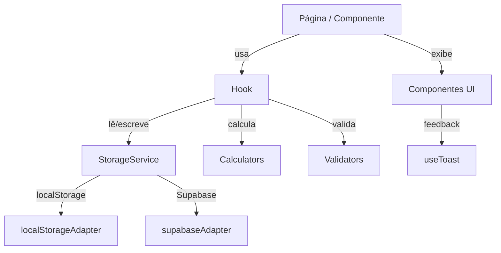

# Design Técnico — ui-improvements

## Visão Geral

Este documento descreve o design técnico para as melhorias de UI/UX do aplicativo **Treine Bem**. O objetivo é modernizar a interface, melhorar a usabilidade mobile e adicionar novas funcionalidades (check-in diário, IMC, consistência semanal, mensagem motivacional, tela de configurações e foto de progresso) **sem reescrever o app do zero** — estendendo os componentes, hooks e serviços já existentes.

### Princípios Guia

- **Extensão, não substituição**: todos os componentes existentes (`MetricCard`, `ExerciseExecutionCard`, `Toast`, `BottomNav`, `SideNav`, hooks, calculators, validators) são mantidos e estendidos.
- **Componentes reutilizáveis em `src/components/ui/`**: qualquer componente usado em mais de uma tela vai para essa pasta.
- **TypeScript estrito**: nenhum `any`; todas as props e retornos de hooks tipados.
- **Acessibilidade**: `aria-label`, `role`, `aria-live`, `aria-current`, `aria-pressed` em todos os elementos interativos novos.
- **Responsividade**: layout funcional de 320 px a 1440 px.

---

## Arquitetura

O app já segue uma arquitetura em camadas bem definida. As melhorias respeitam essa estrutura:

```
src/
├── app/                        # Next.js App Router — páginas e layouts
│   ├── page.tsx                # Dashboard (estendido)
│   ├── workout/page.tsx        # Treino (estendido)
│   ├── plan/page.tsx           # Plano Semanal (estendido)
│   ├── history/page.tsx        # Histórico (estendido)
│   ├── goals/page.tsx          # Metas (estendido)
│   └── settings/page.tsx       # ← NOVO: Configurações
├── components/
│   ├── cards/
│   │   └── MetricCard.tsx      # Existente (sem alteração)
│   ├── ui/
│   │   ├── Toast.tsx           # Existente (estendido: multi-toast, duração configurável)
│   │   ├── LoadingSpinner.tsx  # Existente (mantido)
│   │   ├── LogoutButton.tsx    # Existente (mantido)
│   │   ├── ProgressBar.tsx     # ← NOVO
│   │   ├── EmptyState.tsx      # ← NOVO
│   │   ├── SkeletonCard.tsx    # ← NOVO
│   │   └── ConfirmDialog.tsx   # ← NOVO (extraído do plan/page.tsx)
│   ├── dashboard/
│   │   ├── DailyCheckin.tsx    # ← NOVO
│   │   ├── WeeklyConsistencyIndicator.tsx  # ← NOVO
│   │   └── MotivationalCard.tsx            # ← NOVO
│   ├── goals/
│   │   ├── BMICard.tsx         # ← NOVO
│   │   └── WorkoutSummaryModal.tsx  # ← NOVO (para /workout)
│   └── settings/
│       └── ProgressPhotoGallery.tsx  # ← NOVO
├── hooks/
│   ├── useDashboard.ts         # Existente (estendido: weekSummary, todayLog)
│   ├── useToast.ts             # ← NOVO
│   ├── useSettings.ts          # ← NOVO
│   └── useProgressPhotos.ts    # ← NOVO
└── lib/
    ├── calculators/
    │   ├── bmi.calculator.ts   # ← NOVO
    │   └── motivational.ts     # ← NOVO (lista de mensagens + seleção por data)
    └── validators/
        └── settings.validator.ts  # ← NOVO
```

### Fluxo de Dados



---

## Componentes e Interfaces

### Componentes UI Reutilizáveis (`src/components/ui/`)

#### `ProgressBar`

Já existe uma implementação local em `src/app/goals/page.tsx`. Será **extraída** para `src/components/ui/ProgressBar.tsx` e usada em `/goals` e `/settings`.

```typescript
interface ProgressBarProps {
  /** Fração 0–1 (clamped internamente) */
  value: number
  variant?: 'blue' | 'green' | 'yellow' | 'red'
  /** Altura da barra em px (padrão: 8) */
  height?: number
  /** Label acessível para o progressbar */
  label: string
}
```

#### `EmptyState`

```typescript
interface EmptyStateProps {
  /** Ícone SVG ou emoji */
  icon?: React.ReactNode
  message: string
  /** Botão de ação opcional */
  action?: {
    label: string
    href?: string
    onClick?: () => void
  }
}
```

#### `SkeletonCard`

```typescript
interface SkeletonCardProps {
  /** Número de linhas de texto simuladas (padrão: 2) */
  lines?: number
  /** Altura do card em px (padrão: 80) */
  height?: number
  className?: string
}
```

Usa `animate-pulse` e `bg-gray-700` para simular o formato dos cartões reais.

#### `ConfirmDialog`

Extraído do `plan/page.tsx` (onde já existe inline). Reutilizável em qualquer tela que precise de confirmação antes de ação destrutiva.

```typescript
interface ConfirmDialogProps {
  isOpen: boolean
  title: string
  description: string
  confirmLabel?: string
  cancelLabel?: string
  onConfirm: () => void
  onCancel: () => void
  /** Variante do botão de confirmação (padrão: 'danger') */
  variant?: 'danger' | 'primary'
}
```

#### `Toast` (extensão)

O `Toast.tsx` existente será estendido para suportar:
- Duração configurável (`duration?: number`, padrão 3000 ms para sucesso, 5000 ms para erro)
- Empilhamento via `useToast` hook (ver abaixo)
- Posicionamento: canto superior direito em desktop (`md:top-4 md:right-4 md:bottom-auto md:left-auto`), parte inferior centralizada em mobile (comportamento atual mantido)

### Componentes de Dashboard (`src/components/dashboard/`)

#### `DailyCheckin`

```typescript
interface DailyCheckinProps {
  /** Log do dia atual (para pré-preencher campos) */
  todayLog: DailyLog | null
  onSave: (weight?: number, water?: number) => Promise<void>
}
```

Exibe dois campos inline (peso e água) com validação imediata e botão "Salvar" por campo. Não navega para outra tela.

#### `WeeklyConsistencyIndicator`

```typescript
interface WeeklyConsistencyIndicatorProps {
  /** Array de 7 status, índice 0 = segunda */
  days: Array<{
    dayLabel: string  // 'Seg', 'Ter', etc.
    status: 'trained' | 'rest' | 'missed' | 'future'
  }>
  isPerfectWeek: boolean
}
```

Renderiza 7 círculos coloridos: verde (`trained`), cinza (`rest`), vermelho (`missed`), cinza claro (`future`). Exibe badge dourado "Semana Perfeita 🏆" quando `isPerfectWeek = true`.

#### `MotivationalCard`

```typescript
interface MotivationalCardProps {
  message: string
}
```

Cartão simples com borda sutil (`border border-gray-700`) e texto em `text-sm italic text-gray-300`.

### Componentes de Metas/Treino

#### `BMICard`

```typescript
interface BMICardProps {
  bmi: number | null
  classification: BMIClassification | null
  /** Se null, exibe mensagem para cadastrar altura */
  heightCm: number | null
}

type BMIClassification =
  | 'underweight'
  | 'normal'
  | 'overweight'
  | 'obesity_1'
  | 'obesity_2'
  | 'obesity_3'
```

#### `WorkoutSummaryModal`

```typescript
interface WorkoutSummaryModalProps {
  isOpen: boolean
  summary: {
    totalExercises: number
    completedExercises: number
    totalSets: number
    totalWeightKg: number
    estimatedDurationMin: number
  }
  onConfirm: () => void
  onClose: () => void
}
```

Modal com `role="dialog"` e `aria-modal="true"`. Exibe resumo do treino antes de confirmar e salvar.

### Componentes de Configurações

#### `ProgressPhotoGallery`

```typescript
interface ProgressPhoto {
  id: string
  date: ISODateString
  /** URL do objeto (blob URL ou URL do Supabase Storage) */
  url: string
}

interface ProgressPhotoGalleryProps {
  photos: ProgressPhoto[]
  onAdd: (file: File) => Promise<void>
  onDelete: (id: string) => void
}
```

---

## Modelos de Dados

### Extensões de Tipos Existentes

#### `UserSettings` (novo tipo em `src/types/index.ts`)

```typescript
export interface UserSettings {
  /** Nome de exibição do usuário */
  displayName?: string
  /** Altura em cm (inteiro 100–250) */
  heightCm?: number
  /** Data de nascimento (ISO date string) */
  birthDate?: ISODateString
}
```

#### `StorageService` (extensão da interface existente)

```typescript
// Adicionado à interface StorageService existente:
getUserSettings(): UserSettings | null
saveUserSettings(settings: UserSettings): void

// Para fotos de progresso (opcional):
getProgressPhotos(): ProgressPhoto[]
saveProgressPhoto(photo: ProgressPhoto): void
deleteProgressPhoto(id: string): void
```

#### `CardioLog` (já existe no Prisma, mas não no StorageService)

O `ExerciseExecution` já é usado para registrar cardio (com `exerciseId: 'cardio-extra'`). Esse padrão é mantido — não há novo tipo de dado para cardio no storage local.

### Chaves de Storage

```typescript
// Adicionadas ao objeto KEYS em storage.service.ts:
USER_SETTINGS: 'user-settings',
PROGRESS_PHOTOS: 'progress-photos',
```

### Cálculo de IMC

```typescript
// src/lib/calculators/bmi.calculator.ts

export type BMIClassification =
  | 'underweight'   // < 18.5
  | 'normal'        // 18.5–24.9
  | 'overweight'    // 25–29.9
  | 'obesity_1'     // 30–34.9
  | 'obesity_2'     // 35–39.9
  | 'obesity_3'     // >= 40

export interface BMIResult {
  value: number           // 2 casas decimais
  classification: BMIClassification
}

export function calculateBMI(weightKg: number, heightCm: number): BMIResult
export function classifyBMI(bmi: number): BMIClassification
```

### Mensagem Motivacional

```typescript
// src/lib/calculators/motivational.ts

/** Lista de pelo menos 30 mensagens em português */
export const MOTIVATIONAL_MESSAGES: string[]

/**
 * Seleciona mensagem de forma determinística pela data.
 * Usa: index = (year * 366 + dayOfYear) % MOTIVATIONAL_MESSAGES.length
 */
export function getMotivationalMessage(date: ISODateString): string
```

---

## Propriedades de Correção

*Uma propriedade é uma característica ou comportamento que deve ser verdadeiro em todas as execuções válidas de um sistema — essencialmente, uma declaração formal sobre o que o sistema deve fazer. Propriedades servem como ponte entre especificações legíveis por humanos e garantias de correção verificáveis por máquina.*

### Propriedade 1: Cálculo e Classificação de IMC

*Para qualquer* par válido de peso (30–300 kg) e altura (100–250 cm), o IMC calculado deve ser igual a `peso / (altura / 100)²` arredondado para 2 casas decimais, e a classificação retornada deve corresponder exatamente aos limiares da OMS: Abaixo do peso (< 18,5), Normal (18,5–24,9), Sobrepeso (25–29,9), Obesidade grau I (30–34,9), Obesidade grau II (35–39,9), Obesidade grau III (≥ 40).

**Valida: Requisitos 9.4, 13.2, 13.3**

### Propriedade 2: Determinismo da Mensagem Motivacional

*Para qualquer* data válida no formato ISO (YYYY-MM-DD), chamar `getMotivationalMessage(date)` múltiplas vezes deve sempre retornar a mesma mensagem, e o índice selecionado deve estar dentro dos limites do array de mensagens.

**Valida: Requisitos 11.2, 11.3**

### Propriedade 3: Detecção de Semana Perfeita

*Para qualquer* plano semanal (`WeeklyPlan`) e conjunto de registros diários (`DailyLog[]`), a função de detecção de semana perfeita deve retornar `true` se e somente se todos os dias da semana atual com `dayType !== 'rest'` possuem um `DailyLog` correspondente com `trained = true`.

**Valida: Requisitos 12.2, 12.3, 12.4**

### Propriedade 4: Validação de Campos do Check-in Diário

*Para qualquer* valor de peso fora do intervalo [30, 300] kg, a validação deve rejeitá-lo (retornar erro). *Para qualquer* valor de peso dentro do intervalo [30, 300] kg, a validação deve aceitá-lo. O mesmo vale para água: *para qualquer* valor fora de [0, 10] L, rejeitar; dentro de [0, 10] L, aceitar.

**Valida: Requisitos 10.6, 10.7**

### Propriedade 5: Validação de Altura nas Configurações

*Para qualquer* valor de altura fora do intervalo [100, 250] cm, a validação deve rejeitá-lo (retornar erro). *Para qualquer* valor de altura dentro do intervalo [100, 250] cm (inteiro), a validação deve aceitá-lo.

**Valida: Requisito 14.4**

---

## Tratamento de Erros

### Estratégia Geral

Todos os erros de persistência (`StorageError`) são capturados nos hooks e expostos via `error: StorageError | null`. As páginas consomem esse estado e exibem mensagens de erro descritivas com botão "Tentar novamente" dentro da seção afetada (não em modal global).

### `useToast` Hook

Centraliza o gerenciamento de toasts para evitar duplicação de estado em cada página:

```typescript
interface ToastItem {
  id: string
  message: string
  type: 'success' | 'error'
  duration: number
}

interface UseToastReturn {
  toasts: ToastItem[]
  showSuccess: (message: string) => void
  showError: (message: string) => void
  dismiss: (id: string) => void
}

export function useToast(): UseToastReturn
```

- Sucesso: duração padrão 3000 ms
- Erro: duração padrão 5000 ms
- Empilhamento: máximo 3 toasts simultâneos (o mais antigo é removido ao adicionar o 4º)
- Cada toast tem `id` único (`crypto.randomUUID()`)

### Validação de Formulários

Todos os formulários novos seguem o padrão já estabelecido no codebase:
- Validação no submit (não on-change, exceto para limpar erros já exibidos)
- Erros inline abaixo do campo com `role="alert"`
- Campos inválidos com `aria-invalid="true"` e `aria-describedby` apontando para o elemento de erro

### Erros de Upload de Foto

Arquivo inválido (> 5 MB ou tipo não suportado) exibe Toast de erro imediatamente, sem tentar fazer upload.

---

## Estratégia de Testes

### Abordagem Dual

O projeto usa **Vitest** com **@testing-library/react** para testes de unidade/integração e **fast-check** para testes baseados em propriedades (já instalado como devDependency).

**Testes de unidade** cobrem:
- Comportamentos específicos com exemplos concretos
- Estados de UI (loading, error, empty, filled)
- Interações de formulário
- Casos de borda e condições de erro

**Testes de propriedade** cobrem:
- Funções puras com espaço de entrada amplo
- Invariantes que devem valer para qualquer entrada válida
- Mínimo de 100 iterações por propriedade

### Testes de Propriedade (fast-check)

Cada propriedade do design deve ser implementada como um único teste de propriedade. Tag de referência no comentário do teste:

```
// Feature: ui-improvements, Property N: <texto da propriedade>
```

**Propriedade 1 — IMC**
```typescript
// Feature: ui-improvements, Property 1: IMC calculation and OMS classification
fc.assert(fc.property(
  fc.float({ min: 30, max: 300 }),   // weightKg
  fc.integer({ min: 100, max: 250 }), // heightCm
  (weight, height) => {
    const result = calculateBMI(weight, height)
    const expected = Math.round((weight / Math.pow(height / 100, 2)) * 100) / 100
    return result.value === expected && result.classification === classifyBMI(expected)
  }
), { numRuns: 100 })
```

**Propriedade 2 — Determinismo motivacional**
```typescript
// Feature: ui-improvements, Property 2: motivational message determinism
fc.assert(fc.property(
  fc.date({ min: new Date('2020-01-01'), max: new Date('2030-12-31') }),
  (date) => {
    const iso = date.toISOString().split('T')[0]
    return getMotivationalMessage(iso) === getMotivationalMessage(iso)
      && MOTIVATIONAL_MESSAGES.includes(getMotivationalMessage(iso))
  }
), { numRuns: 100 })
```

**Propriedade 3 — Semana perfeita**
```typescript
// Feature: ui-improvements, Property 3: perfect week detection
// Gera plano semanal aleatório e logs correspondentes, verifica isPerfectWeek
```

**Propriedade 4 — Validação check-in**
```typescript
// Feature: ui-improvements, Property 4: daily check-in field validation
fc.assert(fc.property(
  fc.oneof(
    fc.float({ min: -1000, max: 29.9 }),   // abaixo do mínimo
    fc.float({ min: 300.1, max: 1000 })    // acima do máximo
  ),
  (invalidWeight) => validateCheckinWeight(invalidWeight).valid === false
), { numRuns: 100 })
```

**Propriedade 5 — Validação altura**
```typescript
// Feature: ui-improvements, Property 5: user height validation
fc.assert(fc.property(
  fc.oneof(
    fc.integer({ min: -1000, max: 99 }),   // abaixo do mínimo
    fc.integer({ min: 251, max: 1000 })    // acima do máximo
  ),
  (invalidHeight) => validateHeight(invalidHeight).valid === false
), { numRuns: 100 })
```

### Testes de Unidade por Componente

| Componente/Hook | Casos de teste |
|---|---|
| `ProgressBar` | value=0, value=1, value>1 (clamp), variantes de cor, aria-valuenow |
| `EmptyState` | com ação, sem ação, com ícone |
| `SkeletonCard` | renderiza com animate-pulse, número de linhas |
| `DailyCheckin` | pré-preenchimento, validação inline, save success/error |
| `WeeklyConsistencyIndicator` | 7 círculos presentes, cores corretas por status, badge semana perfeita |
| `MotivationalCard` | renderiza mensagem, estilo italic |
| `BMICard` | sem altura (mensagem de cadastro), com IMC calculado, classificações |
| `WorkoutSummaryModal` | aberto/fechado, dados do resumo, botão confirmar |
| `useToast` | showSuccess, showError, dismiss, empilhamento, duração |
| `useSettings` | load, save, validação de altura |
| `bmi.calculator` | todos os limiares OMS (testes de exemplo para cada faixa) |
| `motivational` | array >= 30 mensagens, índice dentro dos limites |

### Testes de Integração

- `settings/page.tsx`: salvar configurações persiste no storage e exibe Toast
- `page.tsx` (Dashboard): check-in atualiza métricas sem reload
- `goals/page.tsx`: IMC exibido quando altura disponível em settings

### Regressão

Todos os testes existentes devem continuar passando (`npm test`). Nenhum teste existente deve ser modificado — apenas novos testes são adicionados.

---

## Decisões de Design

### Por que extrair `ProgressBar` de `goals/page.tsx`?

A implementação já existe inline em `goals/page.tsx`. Extrair para `src/components/ui/ProgressBar.tsx` evita duplicação quando a mesma barra for usada em `/settings` (progresso de metas de cardio) e potencialmente em `/workout` (progresso de exercícios concluídos).

### Por que `useToast` em vez de estado local em cada página?

O padrão atual (estado `saved` booleano em cada página) não suporta empilhamento nem duração diferenciada por tipo. Um hook centralizado resolve isso sem adicionar um provider global — cada página instancia seu próprio `useToast`.

### Por que `UserSettings` no localStorage e não no Supabase?

O `StorageService` já abstrai o backend (localStorage vs. Supabase). Adicionar `getUserSettings`/`saveUserSettings` à interface mantém a consistência. A implementação concreta pode usar localStorage inicialmente e migrar para Supabase sem alterar os consumidores.

### Por que `WorkoutSummaryModal` em vez de uma nova página?

O requisito 6.8 pede "modal ou tela de resumo". Modal é preferível porque mantém o contexto do treino (estado local do `workout/page.tsx`) sem precisar serializar e deserializar o estado via URL ou storage temporário.

### Por que não criar um `ToastProvider` global?

O app não tem um sistema de estado global (sem Redux, Zustand, etc.). Adicionar um provider global apenas para toasts seria over-engineering. O hook `useToast` por página é suficiente e consistente com o padrão existente.

### Navegação para `/settings`

- **Desktop (SideNav)**: adicionar link "Configurações" com ícone de engrenagem abaixo dos links existentes.
- **Mobile (BottomNav)**: o requisito 4.1 especifica exatamente 5 itens na BottomNav. Configurações será acessível via ícone de engrenagem no canto da BottomNav (fora dos 5 slots principais) ou via menu de overflow — a decisão exata fica para implementação, mas não ocupa um dos 5 slots.

### Foto de Progresso — Armazenamento

Para a implementação inicial, as fotos serão armazenadas como blob URLs no localStorage (limitado a ~5 MB por origem). Para produção com Supabase, o `supabase.adapter.ts` pode ser estendido para usar Supabase Storage. O `ProgressPhotoGallery` recebe URLs abstratas e não conhece o backend.
